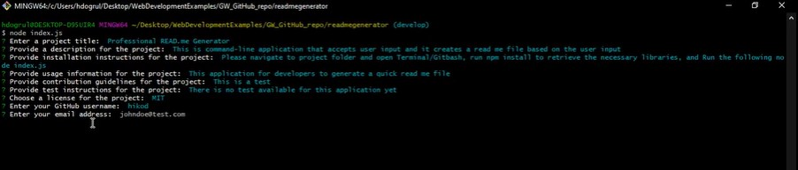

  # Professional READ.me Generator

  ## Description

  This is the project for the week 9
  
  ## Table of Contents
  
  
  * [Installation](#installation)
  * [Usage](#usage)
  
  
  ## Installation

  - Please navigate to project folder and open Terminal/Gitbash, run npm install to retrieve the necessary libraries, and Run the following node index.js
  - After user answers the questions, the application will create a file called README-AutoGenerated.md

  
  ## Usage 

  This application for developers to generate a quick read me file

  ## Tools

  Tools are used Javascript, Node

  ## Screenshots & Additional Info

  
  
  The demo can be found: https://drive.google.com/file/d/1RfFUcx0oxm2jdPrQTsQztbe1OxAscGnI/view?usp=sharing
  The URL to the repo: https://github.com/hikod/readmegenerator

  ## Questions 
    
  https://github.com/hikod

  Please email me for further questions at hikmetdogrul00@gmail.com
